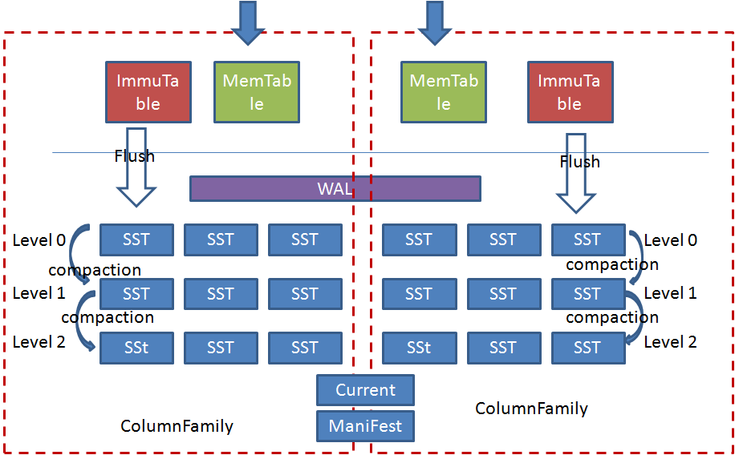
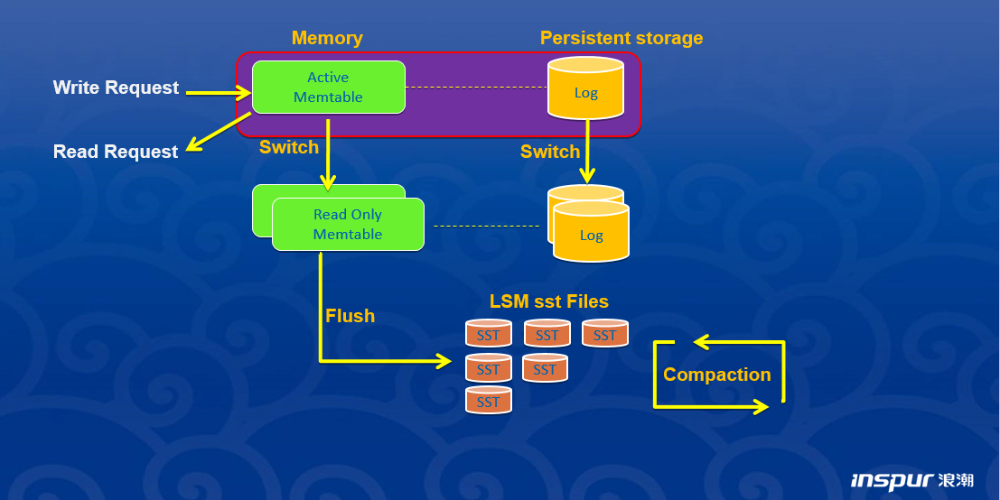

# **相关术语**
### **A**
**ACID**

​		ACID 是指数据库管理系统在写入或更新资料的过程中，为保证事务是正确可靠的，所必须具备的四个特性：原子性(atomicity)、一致性 (consistency)、隔离性（isolation）以及持久性（durability）。

-   原子性 (atomicity)
    指一个事务中的所有操作，或者全部完成，或者全部不完成，不会结束在中间某个环节。

-   一致性 (consistency)
    指在事务开始之前和结束以后，数据库的完整性没有被破坏。ZNBase
    在写入数据之前，会校验数据的一致性，校验通过才会写入内存并返回成功。

-   隔离性 (isolation)
    指数据库允许多个并发事务同时对其数据进行读写和修改的能力。隔离性可以防止多个事务并发执行时由于交叉执行而导致数据的不一致，主要用于处理并发场景。ZNBase
    目前只支持两种隔离级别，即读提交和串行化读。

-   持久性 (durability)
    指事务处理结束后，对数据的修改就是永久的，即便系统故障也不会丢失。在 ZNBase
    中，事务一旦提交成功，数据全部持久化存储到 存储层，此时即使 ZNBase
    服务器宕机也不会出现数据丢失。

### **B**
**Bloom Filter**

​		Bloom filter是由Howard Bloom在1970年提出的[二进制](https://baike.baidu.com/item/%E4%BA%8C%E8%BF%9B%E5%88%B6/361457)向量数据结构，它具有空间和时间效率，被用来检测一个元素是不是集合中的一个成员，rocksDB存储引擎使用Bloom filter来过滤查询的数据是否在SST文件中

### **C**
**Leader/Follower/Candidate**

​		raft中的server有三种状态，分别为Leader,负责接收客户端的读写请求；Flower被动的从Leader同步数据，当Leader失效时会进行选举产生新的Leader，在选举过程中Flower角色会转变为Candidate，参与选举投票竞选Leader

### **N**
**Node**

​		运行 ZNBase 的一个节点，多个节点组成一个集群

### **R**
**Raft**

​		Raft为一种一致性算法协议，Raft协议可以使得一个集群的服务器组成复制状态机，通过强Leader模式确保每一个range和它的其他副本保持数据的强一致性

**Range**

​		ZNBase 所有用户数据（包括数据表、索引等等）和几乎所有的系统数据都存储在一个巨大有序的 key-value 集合。根据连续的 key 划分成多个区间，每个区间是一个 Range

## **数据库参数配置**

​		ZNBase数据库有很多变量参数用来调整数据库的性能，主要分为系统级别的变量参数和会话级别的变量参数，下面详细为大家介绍ZNBase数据库的变量参数与设置方法

ZNBase数据库所有的变量参数都可以通过set 命令进行设置，语法如下:

 **audit.event.disable.list:**

  默认值：空

  用于在邮件告警中设置白名单

 **audit.log.enabled**

  默认值：true

  审计日志的开关,默认审计日志是打开的，不建议将该设置设置为false

  **cloudsink.timeout**

  默认值：10m0s

  加载导出存储的超时时间

 **cluster.preserve_downgrade_option**

  默认值：空

  从指定版本禁用（自动或手动）集群版本升级，直到重置

 **compactor.max_record_age**

  默认值：24h0m0s

  丢弃在此期间未处理的建议（警告：可能会损害集群的稳定性或正确性；请勿在没有监督的情况下进行编辑）

 **compactor.enabled**

  默认值：true

  如果为false，则系统将不太积极地回收已删除数据所占用的空间

  **compactor.min_interval**

  默认值：15s

  压缩之前要等待的最短时间间隔（警告：可能会损害集群的稳定性或正确性；请勿在没有监督的情况下进行编辑）

  **compactor.threshold_bytes**

  默认值：256 MiB

  在考虑汇总建议之前需要的最低预期逻辑空间回收（警告：可能会损害集群的稳定性或正确性；请勿在未经监督的情况下进行编辑）

  **jobs.registry.leniency**

  默认值：1m0s

  推迟尝试重新执行job的时间

 **jobs.retention_time、**

  默认值：336h0m0s

  保留之前完成的job记录的时间

  **kv.allocator.lease_rebalancing_aggressiveness**

  默认值：1

  设置大于1.0可以更积极地使租赁重新平衡以适应负载，或者设置为0到1.0之间可以使租赁重新平衡更加保守

  **kv.allocator.load_based_lease_rebalancing.enabled**

  默认值：true

  设置为基于负载和延迟启用范围租约的重新平衡

 **kv.allocator.load_based_rebalancing**

  默认值：2

  是否根据store之间的QPS分布进行重新平衡[off = 0, leases = 1, leases and replicas= 2]

 **kv.bulk_io_write.addsstable_max_rate**

  默认值：1.7976931348623157E+308

  单个store每秒的最大AddSSTable请求数

 **kv.bulk_io_write.concurrent_addsstable_requests**

  默认值：1

  store在排队之前将同时处理的AddSSTable请求数

 **kv.bulk_io_write.concurrent_export_requests**

  默认值：3

  store在排队之前将同时处理的导出请求数

 **kv.bulk_io_write.concurrent_import_requests**

  默认值：1

  store在排队之前将同时处理的导入请求数

 **kv.bulk_io_write.max_rate**

  默认值：1.0 TiB

  代表批量io ops用于写入磁盘的速率限制（字节/秒）

 **kv.closed_timestamp.follower_reads_enabled**

  默认值；true

  允许（所有）副本基于封闭的时间戳信息提供一致的历史读取

  **kv.load.buffer.size**

  默认值：64 MiB

  Bulk adder的缓存大小（警告：可能会损害群集的稳定性或正确性；请勿在未经监督的情况下进行编辑）

 **kv.load.concurrency**

  默认值：2

  加载期间转换kv数据的并发goroutine的数量（警告：可能会损害群集的稳定性或正确性；请勿在没有监督的情况下进行编辑）

 **kv.raft_log.disable_synchronization_unsafe**

  默认值：false

  设置为true可禁用将Raft日志写入持久性存储时的同步。
  设置为true可能会导致服务器崩溃时数据丢失或数据损坏的风险。
  该设置仅用于内部测试，不应在生产中使用

 **kv.snapshot_rebalance.max_rate**

  默认值：8.0 MiB

  用于重新平衡和向上复制快照的速率限制（字节/秒）

 **kv.snapshot_recovery.max_rate**

  默认值：8.0 MiB

  恢复快照使用的速率限制（字节/秒）

  **kv.transaction.max_intents_bytes**

  默认值：262144

  用于跟踪事务中的写意图的最大字节数

  **kv.transaction.max_refresh_attempts**

  默认值：5

  单个事务批处理可以触发刷新跨度尝试的最大次数

 **kv.transaction.parallel_commits_enabled**

  默认值：true

  如果启用，事务提交将与事务写入并行化

  **server.rangelog.ttl**

  默认值：720h0m0s

  如果不为零，则早于此持续时间的范围日志条目每10m0s删除一次。 不应降低到24小时以下

  **server.remote_debugging.mode**

  默认值：空

  设置为启用远程调试，仅限本地主机或禁用（any，local，off）

 **server.shutdown.query_wait**

  默认值：10s

  服务器将至少等待此时间才关闭，以完成活动查询

 **server.web_session_timeout**

  默认值：168h0m0s

  新创建的Web会话有效的持续时间

 **sql.defaults.default_int_size**

  默认值：8

  INT类型的大小（以字节为单位）

  **sql.defaults.distsql**

  默认值：1

  默认的分布式SQL执行模式 [off = 0); auto = 1); on = 2]

  **sql.defaults.optimizer**

  默认值：1

  默认的基于成本的优化器模式 [off = 0); on = 1); local = 2]

 **sql.defaults.results_buffer.size**

  默认值：16KiB

  缓冲区的默认大小，该缓冲区在将一条语句或一批语句的结果发送到客户端之前会对其进行累加。
  可以在单个连接上使用'results_buffer_size'参数覆盖此参数。
  请注意，自动重试通常仅在没有结果交付给客户端时才会发生，因此减小此大小会增加客户端收到的可重试错误的数量。
  另一方面，增加缓冲区大小可能会增加延迟，直到客户端收到第一个结果行。
  更新设置仅影响新连接。 设置为0将禁用任何缓冲**。**

 **sql.distsql.distribute_index_joins**

  默认值：true

  如果设置，对于索引连接，我们在具有流的每个节点上实例化连接读取器；
  如果未设置，则使用单个联接读取器

  **sql.distsql.max_running_flows**

  默认值：500

  节点上可以运行的最大并发流数

  **sql.distsql.temp_storage.workmem**

  默认值：64 MiB

  使用临时存储之前，处理器可以使用的最大内存量（以字节为单位）

  **sql.metrics.statement_details.dump_to_logs**

  默认值：false

  定期清除时将收集的语句统计信息dump到节点日志

  **sql.query_cache.enabled**

  默认值：true

  启用查询缓存

 **sql.stats.automatic_collection.enabled**

  默认值：true

  自动统计收集模式

  **sql.stats.automatic_collection.fraction_stale_rows**

  默认值：0.2

  每个表的过时行的目标部分，这将触发统计信息刷新

 **sql.stats.automatic_collection.min_stale_rows**

  默认值：500

  每个目标表的过时行的最小数量，这将触发统计信息刷新

 **sql.stats.post_events.enabled**

  默认值：false

  如果设置为true，将为每个CREATE STATISTICS Job显示一个事件

 **sql.trace.log_statement_execute**

  默认值：false

  设置为true以启用对执行语句的记录

 **sql.trace.session_eventlog.enabled**

  默认值：false

  设置为true以启用会话跟踪

  **sql.trace.txn.enable_threshold**

  默认值：0s

  跟踪所有事务的持续时间（设置为0以禁用）

  **timeseries.storage.resolution_10s.ttl**

  默认值：240h0m0s

  以10秒分辨率存储的时间序列数据的最大寿命。 早于此的数据将被汇总和删除。

 **timeseries.storage.resolution_30m.ttl**

  默认值：2160h0m0s

  以30分钟的分辨率存储的时间序列数据的最长使用期限。 早于此的数据将被删除。

## **存储引擎**

​		ZNBase数据库底层存储采用的是RocksDB,[RocksDB](https://github.com/facebook/rocksdb) 是由 Facebook 基于 LevelDB开发的一款提供键值存储与读写功能的 LSM-tree架构引擎。用户写入的键值对会先写入磁盘上的 WAL (Write Ahead Log)，然后再写入内存中的跳表（SkipList，这部分结构又被称作 MemTable）。

​		LSM-tree引擎由于将用户的随机修改（插入）转化为了对 WAL 文件的顺序写，因此具有比 B树类存储引擎更高的写吞吐。内存中的数据达到一定阈值后，会刷到磁盘上生成 SST 文件 (Sorted String Table)，SST又分为多层（默认至多 6 层），每一层的数据达到一定阈值后会挑选一部分 SST合并到下一层，每一层的数据是上一层的 10 倍（因此 90% 的数据存储在最后一层）。

​		RocksDB 允许用户创建多个 ColumnFamily ，这些 ColumnFamily各自拥有独立的内存跳表以及 SST 文件，但是共享同一个 WAL
文件，这样的好处是可以根据应用特点为不同的 ColumnFamily选择不同的配置，但是又没有增加对 WAL 的写次数。

**RocksDB架构**

​		Rocksdb中引入了ColumnFamily(列族,CF)的概念，所谓列族也就是一系列kv组成的数据集。所有的读写操作都需要先指定列族。写操作先写WAL，再写memtable，memtable达到一定阈值后切换为Immutable Memtable，只能读不能写。后台Flush线程负责按照时间顺序将Immu Memtable刷盘，生成level0层的有序文件(SST)。后台合并线程负责将上层的SST合并生成下层的SST。Manifest负责记录系统某个时刻SST文件的视图，Current文件记录当前最新的Manifest文件名。

​		每个ColumnFamily有自己的Memtable，SST文件，所有ColumnFamily共享WAL、Current、Manifest文件，用户可以基于RocksDB构建自己的columnfamilies。很多应用程序把RocksDB当做库(libary),尽管他提供server或者CLI接口。

 **LSM-Tree**

​		数据首先写入到内存中，构建一颗有序小树，随着小树越来越大，内存的小树会flush到磁盘上，磁盘中的树定期可以做 merge 操作，合并成一棵大树，以优化读性能

 **基本概念**

**Memtable**

  一个内存数据结构，保存了落盘到SST文件前的数据，新的写入总是将数据插入到memtable，写满，会变成不可修改，并切换到新的memtable。读取在查询SST文件前总是要查询memtable 可配置的数据结构 默认SkipList HashLinkList，HashSkipList或者Vector

 **WAL**

  预写日志文件（Write Ahead Log File）一个可顺序写入的持久存储文件，用于RocksDB异常时恢复到一致性状态。 多个Column Family共享同一个WAL，当打开DB时或一个CF的Memtable flush的会创建新的WAL旧的WAL不再写入。所有CF落盘后，旧WAL归档并删除

 **SST**

  持久化的SST文件（Sorted String Table）

  已按Key排序的持久存储文件，以层次方式组织，整个生命周期内都是只读、不可修改已排序的数据-\>可实现key的快速扫描，可扩展的存储格式-\>默认BlockBasedTable

**写入流程**

​		写操作先写WAL，再写memtable，memtable达到一定阈值后切换为Immutable，Memtable，只能读不能写。后台Flush线程负责按照时间顺序将ImmuMemtable刷盘，生成level0层的有序文件(SST)。后台合并线程负责将上层的SST合并生成下层的SST

 **读取流程**

