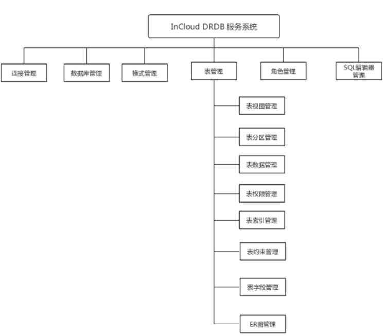
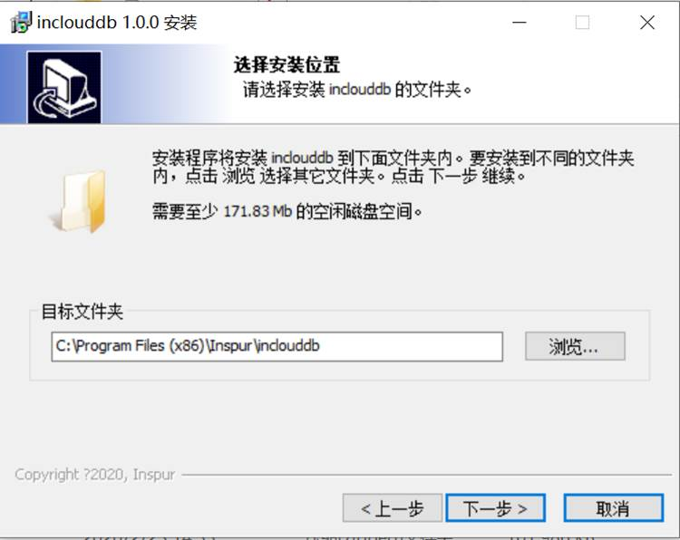
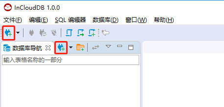
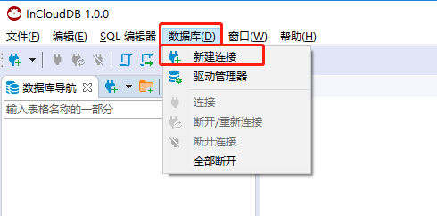
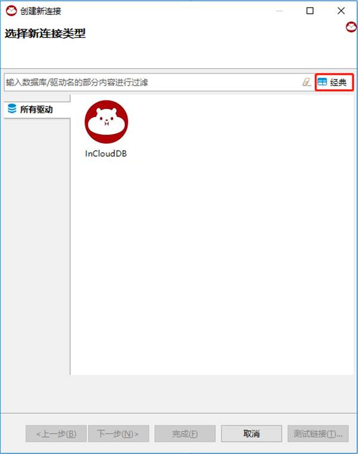
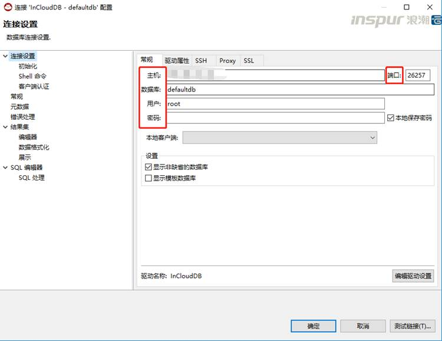
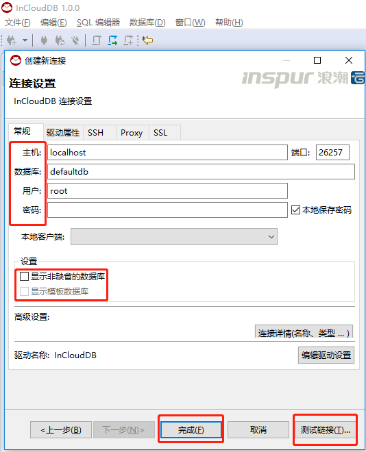
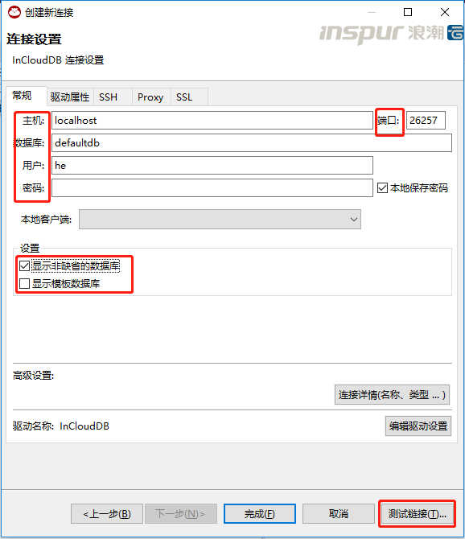
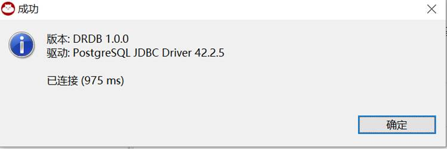

# **生态工具**

## **InCloud** **DRDB**

### **概述**

InCloud DRDB 服务系统是针对数据库 InCloud DRDB 定做的可视化管理工具，InCloud DRDB将数据库相关的所有操作可视化，为用户提供一个便捷的操作平台，其相关的功能模块涉及到数据库的操作、模式的操作以及触发器等，几乎囊括了所有的数据库的操作。

InCloud DRDB 系统整体实现包括了 UI 层、接口层、业务层以及驱动层。采

用 JDBC 驱动结合 SWT 等相关技术层层递进，最终实现 UI 层的可视化操作，

其相关操作的 SQL 语句对使用者来说也是可见的，使用者甚至可以直接通过 UI

层的 SQL 编辑器用 SQL 语句对数据库进行操作。

​    其对应结构图如下：

### **安装**

**zip安装**

 

a)解压

b）解压目录

c）运行inclouddb.exe即可实用

 

**setup安装**

 

强烈建议您关闭所有打开的应用程序。这将有助于确保顺利安装。

a）安装下载版本

b）下载Hamster Windows版本。

c）打开.exe文件。

d）在欢迎屏幕上单击下一步。

e）单击“ 下一步”接受程序图标的位置。如果要更改文件夹的目的地，请单击浏览。

遵循其余步骤。

 

## **数据库连接**

单击应用程序工具栏或“数据库浏览器”视图工具栏中的“新建连接”按钮：

在菜单栏中单击数据库-> 新建连接：

然后再向导中，单击数据库连接，然后单击下一步：

​    选择“InCloud DB”驱动。

在“连接设置”屏幕的“常规”选项卡上，设置所有主要连接设置：

 

### **Root**    **安全模式登录**

准备文件：“ca.crt”，“client.root.crt”,“client.root.pk8”。

以上文件生成方式请查阅其他手册。

点击连接设置：

接下来，填写相应的主机的ip地址、端口号，要连接的数据库名称，数据库所在的用户，（建议勾选显示非缺省数据库）然后点击测试连接，下载需要的工具（如果需要），最后点击“完成”即可。

注意：勾选“显示非缺省的数据库”，会显示所有存在的数据库。默认只会显示指定连接的数据库。

点击“SSL”，添加“根证书”，“SSL证书”，“SSL证书密钥”。

l 根证书：使用`ca.crt`为安全集群生成的文件。

l SSL证书：使用从群集的根证书生成的客户端证书。对于root用户，它将被命名为`client.root.crt`。

l SSL证书密钥：您需要`*.pk8`使用[OpenSSL命令](https://wiki.openssl.org/index.php/Command_Line_Utilities#pkcs8_.2F_pkcs5)将密钥文件转换为格式，如下所示。创建文件后，请在此处输入其位置。在此示例中，文件名是`client.root.pk8`。

SSL模式包含以下六种模式：

Disable：禁用

allow：允许

prefer：偏好

require：请求

verify-ca：验证CA

verify-full：完整验证

如果成功，则会报以下信息：

现在可以连接数据库并使用。

### **用户安全模式登录**

 

该方式需要在数据库中创建用户并设置密码，已经创建成功用户he。

点击新建连接：

接下来，填写相应的主机的ip地址、端口号，要连接的数据库名称，数据库所在的用户和密码，（建议勾选显示非缺省数据库）然后点击测试连接。

注意：填写用户名以及密码（必须），点击测试链接，如连接成功，则会报以下信息。

 

### **Root**   **非安全模式登录**

 

点击界面左侧文件下方的连接图片或者箭头，或者点击导航栏上方的数据库新建连接，选择要连接的数据库的类型去创建新的连接。

接下来，填写相应的主机的ip地址、端口号，要连接的数据库名称，数据库root用户，（建议勾选显示非缺省数据库）然后点击测试连接。

注意：这种方式不需要密码。

点击测试链接，弹出成功提示框。

 

### **用户非安全模式登录**

 

点击界面左侧文件下方的连接图片或者箭头，或者点击导航栏上方的数据库新建连接，选择要连接的数据库的类型去创建新的连接。

接下来，填写相应的主机的ip地址、端口号，要连接的数据库名称，数据库所使用的用户，（建议勾选显示非缺省数据库）然后点击测试连接。

注意：这种方式不需要密码。

点击测试链接，弹出成功提示框。

